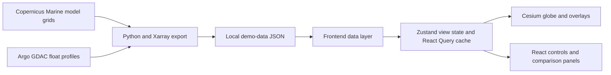
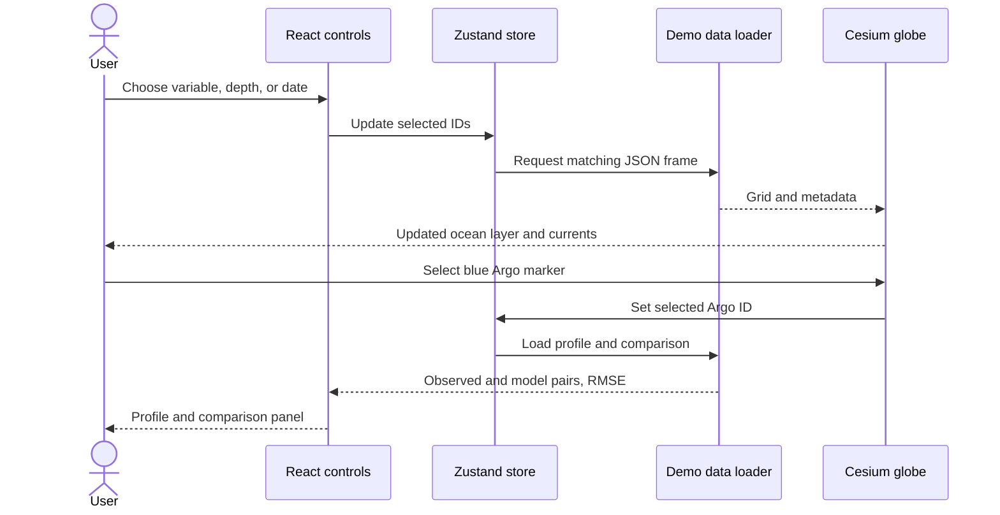
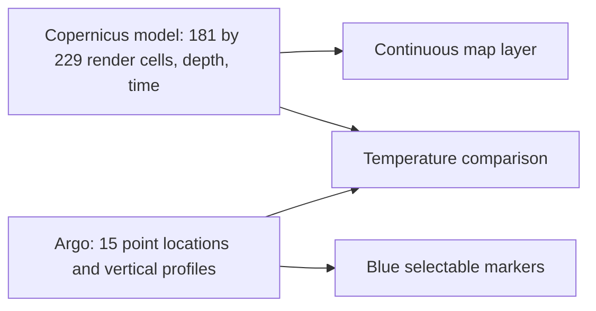

# OceanX

OceanX is an interactive 3D ocean explorer for the Bay of Bengal: a Google Earth style view of ocean conditions across location, depth, and time.

**What it does:** Explore Copernicus temperature and salinity on a Cesium globe, animate surface currents, change among prepared depths and dates, then select a real Argo float to inspect its profile and compare observed temperature with the model.

| Prepared model data | Observations |
| --- | --- |
| 181 × 229 render grid: **41,449 cells per frame** at about 0.083° spacing | **15 real Argo profiles** in the analysis region |
| 4 dates × 6 depths × 4 variables = **96 model grids** | 15 valid temperature profiles; 14 valid salinity profiles |
| 121 × 145 cells (**17,545**) in the inner analysis box | 15 precomputed model–observation temperature comparisons |



## Why OceanX

Ocean conditions change below the surface and over time, while observations are scattered across individual float locations. OceanX places a dense model field and sparse measured profiles in one geographic view so a reviewer can see both the pattern and where it disagrees with a measurement.

## Current Prototype

The working prototype starts over the Bay of Bengal. Controls select temperature or salinity, one of six prepared depth levels, and one of four daily frames from 20–23 April 2025. Currents can be shown as animated particles, and blue Argo markers can be selected to open vertical profiles, a model-versus-observation chart, RMSE, and a largest-difference insight. The comparison is for **temperature**; a salinity comparison is not exported. The displayed depth is a requested label mapped to the nearest actual Copernicus level.

## Real Data Sources

| Source | Role | Used data |
| --- | --- | --- |
| [Copernicus Marine Global Ocean Physics Analysis and Forecast](https://data.marine.copernicus.eu/product/GLOBAL_ANALYSISFORECAST_PHY_001_024/services), product `GLOBAL_ANALYSISFORECAST_PHY_001_024` | Dense gridded model field | Daily potential temperature (`thetao`), salinity (`so`), eastward (`uo`) and northward (`vo`) current velocity |
| [Argo Global Data Assembly Centres](https://argo.ucsd.edu/data/data-from-gdacs/) | Sparse in situ observations | Float positions and quality controlled, delayed mode adjusted vertical temperature and salinity profiles |

The bundled data has fixed dates and is served as local JSON. Running the frontend does not query either provider.

## Architecture

The Python exporter in [`scripts/prepare_demo_data.py`](scripts/prepare_demo_data.py) coordinates Copernicus downloads, Argo selection, JSON export, comparisons, and validation. Its modules in [`scripts/demo_data/`](scripts/demo_data/) do the scientific data work. The Vite/React frontend reads [`manifest.json`](frontend/public/demo-data/manifest.json) first, then loads selected frames and related assets. Cesium renders the globe; the UI and globe share selection through Zustand.

## Data Flow





The blue Argo markers indicate measured float locations; they are **not** model-grid cells.

## Ocean Model Dataset

The three daily Copernicus datasets are `cmems_mod_glo_phy-thetao_anfc_0.083deg_P1D-m`, `cmems_mod_glo_phy-so_anfc_0.083deg_P1D-m`, and `cmems_mod_glo_phy-cur_anfc_0.083deg_P1D-m`. Exported `u` and `v` are separate depth/date grids. Four additional `currents/t*.json` files contain surface `u`, `v`, and derived speed for the particle display. Land and missing model cells remain `null`, not fabricated ocean values.

| Extent | Bounds | Grid |
| --- | --- | --- |
| `analysisBounds` | 10–20°N, 80–92°E | 121 × 145 = 17,545 cells |
| `renderBounds` | 7–22°N, 77–96°E | 181 × 229 = 41,449 cells |

The larger render extent pads every side of the logical analysis region so the colored layer and current particles remain visible around the Bay of Bengal view. The native spacing is approximately 1/12° (0.08333°). The four model timestamps are 00:00 UTC on 20, 21, 22, and 23 April 2025.

| Requested depth | Actual model depth |
| ---: | ---: |
| 0 m | 0.494025 m |
| 50 m | 47.373692 m |
| 100 m | 92.326073 m |
| 150 m | 155.850693 m |
| 200 m | 186.125595 m |
| 500 m | 541.088928 m |

## Argo Observations

The 15 selected real profiles fall between approximately 10.16943–17.88333°N and 84.594–91.13333°E, observed from 20 April 2025 14:13:45 UTC through 23 April 2025 18:09:06 UTC. All 15 have valid temperature; 14 have valid salinity. The exporter uses adjusted delayed mode values with good quality flags, converts pressure to depth, and keeps missing salinity masked.

For each float, the exporter takes the nearest model time and horizontal grid point, interpolates the model vertical temperature profile to valid observed depths within their overlap, and computes `difference = model − observation` and RMSE. The insight reports the largest paired temperature difference and depth; it does not diagnose its cause.

## Frontend Architecture

| Component | Current implementation |
| --- | --- |
| 3D globe | Cesium viewer in [`frontend/src/globe/`](frontend/src/globe/) |
| Ocean layer | Canvas colored from real temperature/salinity grid values, then added as a Cesium single-tile imagery layer; missing cells are transparent |
| Currents | Canvas particle overlay driven by the prepared surface velocity grid |
| Argo markers | Selectable Cesium entities connected to shared Argo selection |
| State and loading | Zustand in [`frontend/src/store/`](frontend/src/store/); cached JSON loader in [`frontend/src/data/`](frontend/src/data/); React Query for panel requests |
| Interface | React and Tailwind CSS controls; Apache ECharts profile/comparison charts |

## Repository Structure

```text
OceanX/
├── frontend/
│   ├── public/demo-data/       # Runtime manifest, model grids, Argo, comparisons
│   ├── src/globe/              # Cesium and renderers
│   ├── src/data/               # Typed JSON loader and adapters
│   ├── src/store/              # Shared view state
│   └── src/components/         # Controls, layout, charts, panels
├── scripts/
│   ├── prepare_demo_data.py    # Export/validation command
│   ├── demo_data/              # Copernicus, Argo, comparison, validation modules
│   └── tests/                  # Data pipeline tests
├── docs/                       # Data contracts and provenance
├── data/raw/                   # Ignored source downloads/cache
└── backend/                    # Separate minimal API scaffold; not used by the demo
```

## Running the Project

Node.js and npm are required. The committed demo assets are sufficient to run the frontend without Copernicus credentials.

```bash
cd frontend
npm ci
npm run dev
```

Open the local URL printed by Vite. Use `npm run build` for a production build and `npm run preview` to serve it. The globe includes local Natural Earth imagery; the optional high-resolution Esri imagery layer uses an external tile service.

## Data Preparation

Regeneration requires Python 3.12+, the packages in [`scripts/requirements-demo-data.txt`](scripts/requirements-demo-data.txt), access to Argo GDAC, and Copernicus Marine authentication for model downloads. From the repository root, after activating a Python environment:

```bash
python -m pip install -r scripts/requirements-demo-data.txt
python scripts/prepare_demo_data.py inspect
copernicusmarine login
python scripts/prepare_demo_data.py build
python scripts/prepare_demo_data.py validate
```

`inspect` checks catalogue metadata; `build` fetches/caches source NetCDF and Argo files, exports the JSON assets, and validates them. `argo` refreshes observation assets and comparisons using the cached model file; `render` refreshes model frames. Source files are cached under ignored `data/raw/`. See [`docs/demo-data.md`](docs/demo-data.md) for the detailed regeneration procedure.

## Validation

From the repository root, validate exported dimensions, masks, metadata, cross-file references, and comparison arithmetic:

```bash
python scripts/prepare_demo_data.py validate
python -m unittest discover -s scripts/tests -v
cd frontend
npm run test:data
npm run typecheck
npm run build
```

## Current Scope

**Real:** Copernicus model values, geographic coordinates, timestamps, depth levels, temperature/salinity/current grids, and Argo positions and profiles. The exported comparison statistics are calculated from these sources.

**Prototype:** The presentation and interactions, locally served preprocessed JSON frames, fixed four-date window, and precomputed comparisons. The app does not stream live observations or run an on-demand forecast. Older files in `frontend/public/demo-data/ocean-slices/`, `comparison/`, `argo-profiles.json`, and `currents.json` are legacy development assets; the current loader uses `ocean/`, `currents/`, `argo/`, and `comparisons/`.

## Future Direction

The current data contract allows larger regions and time windows or an API-backed loader later. Broader model–observation validation and live data access would require additional processing and operational infrastructure.
